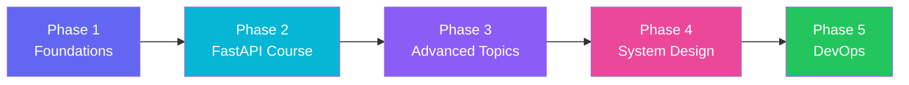
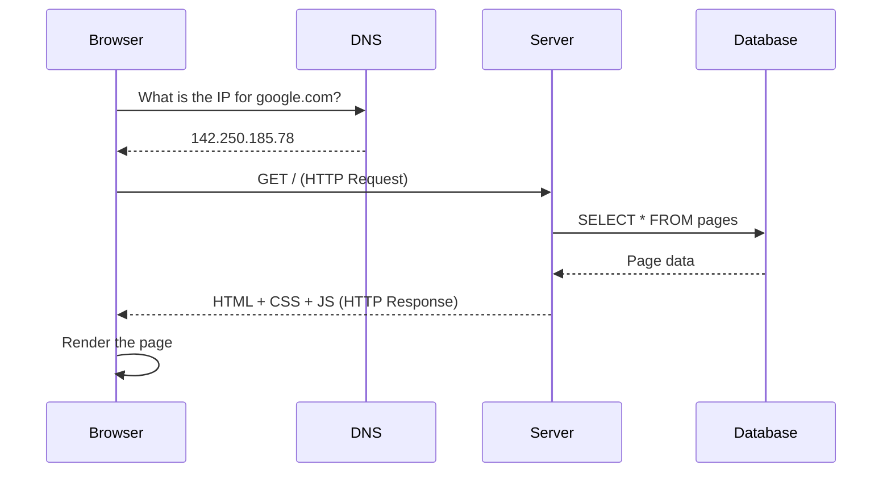
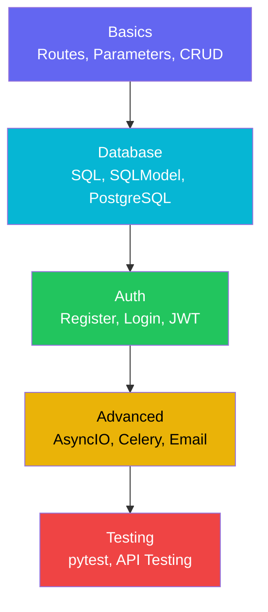
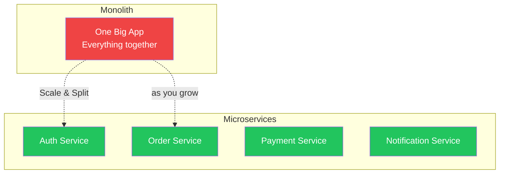
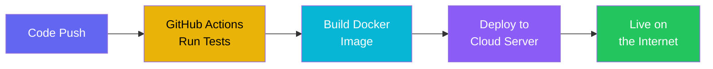

# Q.E.D. — Learning Roadmap
> A complete backend web development learning path — from zero to building and deploying a real project.

---

## How This Roadmap Works

Each phase builds on the previous one. You don't need to finish everything before moving on — start the project early and grow it as you learn.

---

## Phase 1 — Foundations
> Understand how the web works before writing code.

### Networking
These concepts explain what happens every time you open a website:

- [ ] **Client-Server Model** — what happens when you open a website
- [ ] **HTTP/HTTPS Protocol** — Methods (GET, POST, PUT, DELETE), Status Codes, Headers
- [ ] **TCP/IP Stack** — the 4 layers and how data travels
- [ ] **DNS** — how a domain name becomes an IP address
- [ ] **Ports & Sockets** — how the server listens for connections
- [ ] **REST API Concepts** — what RESTful means and its principles
- [ ] **WebSockets** — difference from HTTP and when to use it
- [ ] **SSL/TLS** — how encryption works
- [ ] **CORS** — Cross-Origin Resource Sharing and why it causes issues

### Operating System Basics
- [ ] **Processes vs Threads** — the difference and when to use each
- [ ] **Memory Management** — Stack vs Heap, RAM
- [ ] **I/O Operations** — Blocking vs Non-blocking (related to AsyncIO)
- [ ] **Environment Variables** — how to use them in projects
- [ ] **Linux Basics & Terminal** — servers run Linux
- [ ] **File System & Permissions**

> **Tip:** Don't go too deep here at the start. Learn what's directly relevant to web development, then come back later.

---

## Phase 2 — FastAPI Course
> Master building APIs with Python.

### Part 1: Basics
- [ ] Getting Started
- [ ] Path Parameters
- [ ] Query Parameters
- [ ] CRUD Operations
- [ ] Pydantic Models
- [ ] Custom Response
- [ ] Error Handling

### Part 2: Database
- [ ] SQL Database basics
- [ ] SQLModel ORM
- [ ] PostgreSQL
- [ ] SQL Relations
- [ ] Many to Many relationships

### Part 3: Authentication
- [ ] Register User
- [ ] Login User
- [ ] Logout User
- [ ] Email Confirmation
- [ ] Password Reset

### Part 4: Advanced
- [ ] AsyncIO
- [ ] Send Mail & SMS
- [ ] Reviews system
- [ ] Celery (Background Tasks)
- [ ] Middleware

### Part 5: Testing
- [ ] pytest
- [ ] API Testing

### Part 6: Frontend
- [ ] React JS basics
- [ ] Frontend integration

---

## Phase 3 — Topics Not in the Course
> Essential skills for any real project.

### Database Design
- [ ] **Normalization** (1NF, 2NF, 3NF) — designing tables correctly
- [ ] **Indexing** — making queries faster
- [ ] **Migrations** (Alembic) — managing database changes safely
- [ ] **Transactions** — ACID properties
- [ ] **Connection Pooling** — efficient database connections

### File Handling & Storage
- [ ] **File Uploads** — handling images and documents
- [ ] **Cloud Storage** (AWS S3 / MinIO) — storing files externally
- [ ] **Image Processing** — resizing, compression

### API Design
- [ ] **Pagination** — displaying data in pages
- [ ] **Filtering & Sorting** — refining results
- [ ] **API Versioning** — managing breaking changes
- [ ] **Rate Limiting** — protecting against abuse
- [ ] **Request Validation** — input verification

---

## Phase 4 — System Design & Architecture
> Think bigger — design complete systems, not just single APIs.

### Software Architecture

- [ ] **Monolith vs Microservices** — when to use each
- [ ] **Clean Architecture / MVC** — organizing code professionally
- [ ] **Repository Pattern** — separating business logic from database
- [ ] **Service Layer Pattern**
- [ ] **Dependency Injection** — already in FastAPI (Depends)
- [ ] **SOLID Principles**
- [ ] **Design Patterns** (Factory, Singleton, Observer)

### System Design Concepts
- [ ] **Scalability** — Horizontal vs Vertical Scaling
- [ ] **Load Balancing** — Nginx, HAProxy
- [ ] **Caching Strategies** — Redis, Cache-aside, Write-through
- [ ] **Message Queues** — RabbitMQ, Redis Queue
- [ ] **CDN** — Content Delivery Network
- [ ] **API Gateway**
- [ ] **Logging & Monitoring** — ELK Stack, Prometheus

### Security
- [ ] **OWASP Top 10** — the 10 most critical security risks
- [ ] **SQL Injection Prevention**
- [ ] **XSS Prevention**
- [ ] **CSRF Protection**
- [ ] **Hashing & Encryption** — bcrypt, Argon2

---

## Phase 5 — DevOps & Deployment
> Ship your project to the real world.

### Git & Version Control
- [ ] **Branching Strategy** — GitFlow, Trunk-Based
- [ ] **Pull Requests & Code Review**
- [ ] **Git Hooks** — Pre-commit checks

### Docker
- [ ] **What is Docker & why it matters**
- [ ] **Dockerfile** — building an image
- [ ] **Docker Compose** — running multiple containers
- [ ] **Docker Networking**

### CI/CD
- [ ] **GitHub Actions** — Automated Testing & Deployment
- [ ] **Automated Testing Pipeline**
- [ ] **Continuous Deployment**

### Cloud & Deployment
- [ ] **Linux Server Setup** — VPS (DigitalOcean, AWS)
- [ ] **Nginx** — Reverse Proxy
- [ ] **Domain & SSL** — Let's Encrypt
- [ ] **Environment Management** — .env files, secrets

---

## Priority Guide

| Priority | Topics |
|----------|--------|
| 🔴 **Must Learn** | HTTP & REST, Database & SQL, Auth (JWT), Git, Error Handling, Testing, Docker, Linux, Security, Clean Code |
| 🟡 **Important** | Redis Caching, Celery, File Upload, API Design, Alembic, CI/CD, Nginx, Logging |
| 🟢 **Advanced** | Microservices, Message Queues, Elasticsearch, WebSockets, AWS, System Design Patterns |

---

## Timeline

| Phase | Content |
|-------|---------|
| Phase 1 | Networking + OS Basics |
| Phase 2 | FastAPI Course |
| Phase 3 | Missing Topics + Start Project |
| Phase 4 | System Design + Architecture |
| Phase 5 | DevOps + Deployment |

> We move at whatever pace works for everyone. No fixed deadlines — understanding is what matters.
