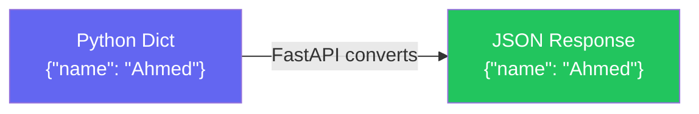
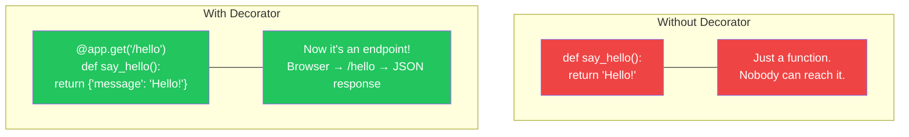
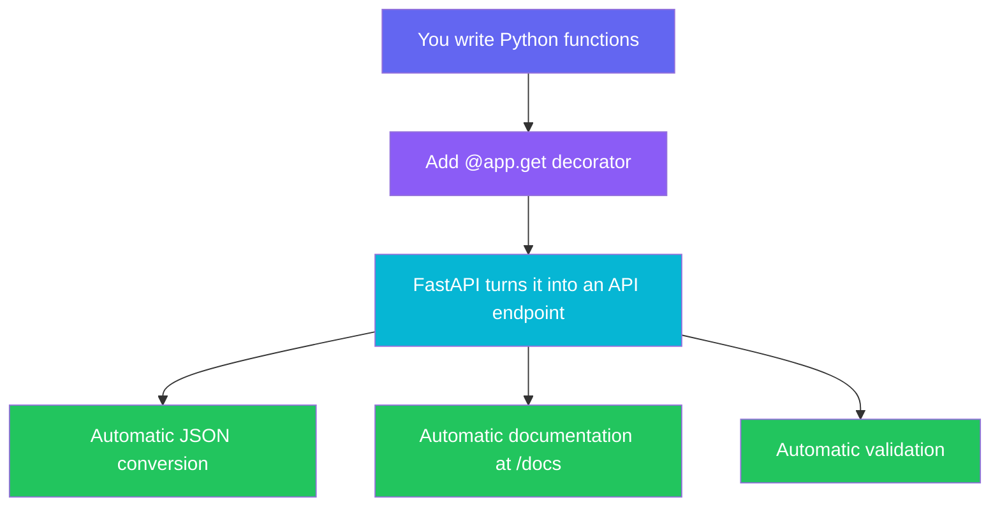
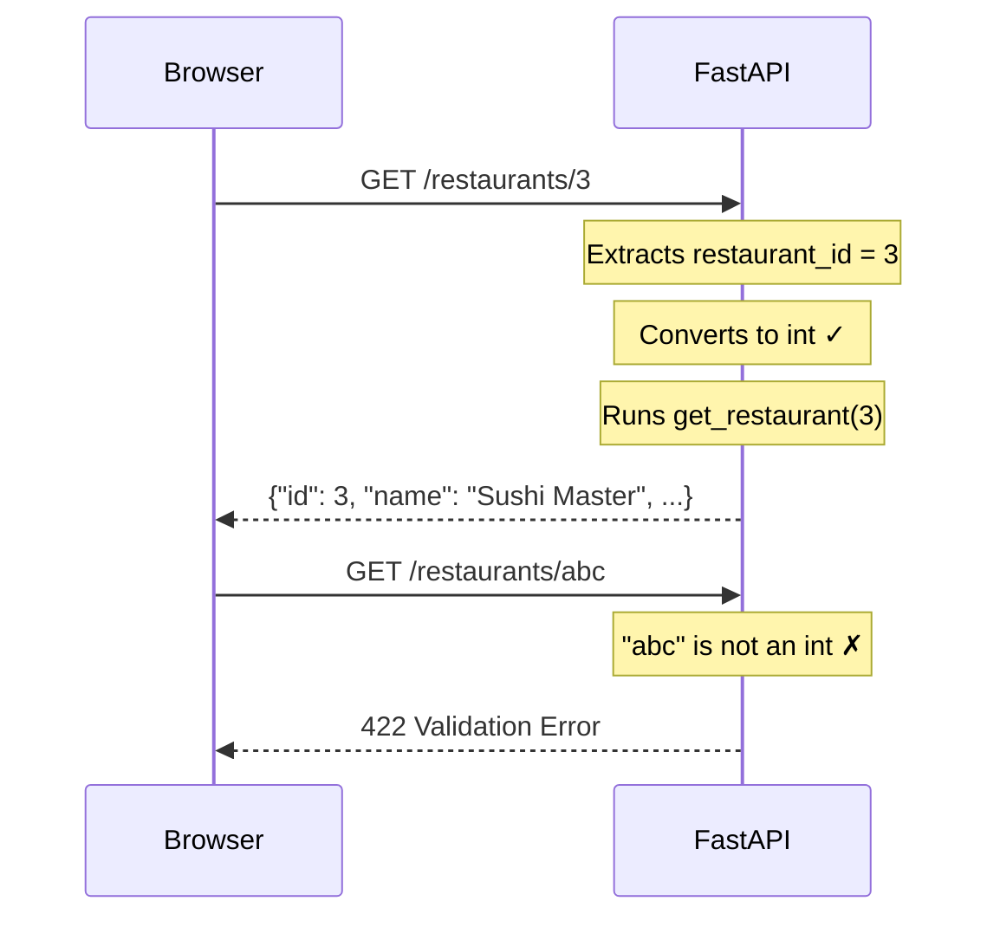

# Part 3 — Your First API

> From zero to a running FastAPI server in 10 minutes.

---

## 1. Setup

Open your terminal and run these commands:

```bash
# Create a project folder
mkdir swiftdrop
cd swiftdrop

# Create a virtual environment
python -m venv venv

# Activate it
# Windows:
venv\Scripts\activate
# Mac/Linux:
source venv/bin/activate

# Install FastAPI + Uvicorn (the server)
pip install fastapi uvicorn
```

> **What is Uvicorn?**
> FastAPI is the framework — it handles your code and logic.
> Uvicorn is the **server** — it listens for incoming requests and passes them to FastAPI.


---

## 2. Before We Code: Python Dictionaries

A Python **dictionary** is a key-value data structure:

```python
# This is a Python dictionary
user = {
    "name": "Ahmed",
    "email": "ahmed@gmail.com",
    "role": "customer"
}

print(user["name"])   # → Ahmed
print(user["role"])   # → customer
```

And this is **JSON** (what APIs use to communicate):

```json
{
    "name": "Ahmed",
    "email": "ahmed@gmail.com",
    "role": "customer"
}
```

**They look identical.** That's not a coincidence — JSON is based on the same key-value concept.

> **The key insight:** In FastAPI, you just return a Python dictionary, and it **automatically** becomes JSON. That's the magic.



---

## 3. What is a Decorator?

A **decorator** is a special line that starts with `@` and sits on top of a function. It modifies what the function does.

### Normal function (no decorator):

```python
def say_hello():
    return "Hello!"

# This is just a regular function.
# Nobody can access it from a browser. It only runs if YOU call it.
```

### Same function WITH a decorator:

```python
from fastapi import FastAPI

app = FastAPI()

@app.get("/hello")
def say_hello():
    return {"message": "Hello!"}
```

**What changed?**

The `@app.get("/hello")` decorator tells FastAPI:

> "When someone opens `/hello` in their browser, run this function and send back whatever it returns — as JSON."

That one line turned a normal Python function into an **API endpoint** that anyone in the world can access.



### Different decorators = Different HTTP methods:

```python
@app.get("/items")       # READ — get data
@app.post("/items")      # CREATE — send new data
@app.put("/items/{id}")  # UPDATE — modify existing data
@app.delete("/items/{id}")  # DELETE — remove data
```

These map directly to the **CRUD** operations:
| Decorator | HTTP Method | CRUD Operation | Example |
|-----------|-------------|---------------|---------|
| `@app.get` | GET | **R**ead | Get all restaurants |
| `@app.post` | POST | **C**reate | Add a new restaurant |
| `@app.put` | PUT | **U**pdate | Change restaurant name |
| `@app.delete` | DELETE | **D**elete | Remove a restaurant |

---

## 4. Your First FastAPI App

Create a file called `main.py`:

```python
from fastapi import FastAPI

# Create the app
app = FastAPI()

# ──────────────────────────────────────────────
# Our SwiftDrop team members
# ──────────────────────────────────────────────

team = [
    {"name": "Ahmed", "role": "Backend Lead"},
    {"name": "Sara", "role": "Frontend Dev"},
    {"name": "Omar", "role": "Full Stack"},
    {"name": "Nour", "role": "DevOps"},
]

# ──────────────────────────────────────────────
# Our SwiftDrop restaurants (fake data for now)
# ──────────────────────────────────────────────

restaurants = [
    {"id": 1, "name": "Pizza Palace", "rating": 4.8, "category": "Italian"},
    {"id": 2, "name": "Burger King", "rating": 4.2, "category": "Fast Food"},
    {"id": 3, "name": "Sushi Master", "rating": 4.9, "category": "Japanese"},
]


# ──────────────────────────────────────────────
# ENDPOINTS
# ──────────────────────────────────────────────

@app.get("/")
def home():
    """The root endpoint — just a welcome message"""
    return {
        "project": "SwiftDrop",
        "description": "A delivery platform built by Q.E.D. Bootcamp",
        "version": "0.1.0"
    }


@app.get("/team")
def get_team():
    """Get all team members"""
    return {
        "team": team,
        "count": len(team)
    }


@app.get("/restaurants")
def get_restaurants():
    """Get all restaurants"""
    return {
        "restaurants": restaurants,
        "count": len(restaurants)
    }


@app.get("/restaurants/{restaurant_id}")
def get_restaurant(restaurant_id: int):
    """Get a specific restaurant by ID"""
    for r in restaurants:
        if r["id"] == restaurant_id:
            return r
    return {"error": "Restaurant not found"}
```

---

## 5. Run It

```bash
uvicorn main:app --reload
```

**What this means:**
| Part | Meaning |
|------|---------|
| `uvicorn` | The server |
| `main` | The file name (`main.py`) |
| `app` | The FastAPI instance inside that file |
| `--reload` | Auto-restart when you change code |

You'll see:

```
INFO:     Uvicorn running on http://127.0.0.1:8000
INFO:     Started reloader process
```

---

## 6. Test It

Open your browser and try these URLs:

| URL | What you'll see |
|-----|----------------|
| http://127.0.0.1:8000/ | SwiftDrop welcome message |
| http://127.0.0.1:8000/team | All team members as JSON |
| http://127.0.0.1:8000/restaurants | All restaurants as JSON |
| http://127.0.0.1:8000/restaurants/1 | Pizza Palace details |
| http://127.0.0.1:8000/restaurants/99 | Error: not found |

### The best part — Automatic API Documentation:

Open: **http://127.0.0.1:8000/docs**

FastAPI automatically generates a full interactive documentation page (Swagger UI) where you can test every endpoint directly from the browser.

> **This is one of the biggest reasons we chose FastAPI.** Other frameworks need plugins and manual setup to get this. FastAPI gives it to you for free.



---

## 7. Line-by-Line Breakdown

Let's break down the most important parts:

### Creating the app
```python
from fastapi import FastAPI    # Import the framework
app = FastAPI()                # Create an instance — this IS your application
```

### A simple endpoint
```python
@app.get("/")                  # Decorator: listen for GET requests on "/"
def home():                    # Just a normal Python function
    return {"project": "SwiftDrop"}  # Return a dict → becomes JSON
```

### Path parameters
```python
@app.get("/restaurants/{restaurant_id}")   # {restaurant_id} is a variable in the URL
def get_restaurant(restaurant_id: int):    # FastAPI extracts it and converts to int
    ...
```

When someone visits `/restaurants/3`:
- FastAPI sees `{restaurant_id}` in the path
- Extracts `3` from the URL
- Converts it to `int` (because of the `: int` type hint)
- Passes it to your function as `restaurant_id = 3`
- If someone sends `/restaurants/abc` → FastAPI returns a **422 Validation Error** automatically



---

## 8. What to Study Before Next Session

Make sure you're comfortable with these Python concepts:

| Concept | Why You Need It |
|---------|----------------|
| **Dictionaries** | API responses are dictionaries → JSON |
| **Lists** | Collections of items (list of restaurants, orders) |
| **Functions** | Every endpoint is a function |
| **Type Hints** | FastAPI uses them for validation (`name: str`, `age: int`) |
| **f-strings** | `f"Hello {name}"` — string formatting |
| **for loops** | Iterating over data |
| **if/else** | Logic and conditions |
| **Classes** (basic) | We'll use them for database models soon |

> **Don't memorize — practice.** Open a Python file, create a dictionary, loop over a list, write a function. If you can do that comfortably, you're ready.

---

## Quick Reference

```python
from fastapi import FastAPI

app = FastAPI()

# GET — Read data
@app.get("/path")
def read():
    return {"key": "value"}

# POST — Create data
@app.post("/path")
def create():
    return {"created": True}

# Path parameter
@app.get("/items/{item_id}")
def read_item(item_id: int):
    return {"id": item_id}

# Run: uvicorn main:app --reload
# Docs: http://127.0.0.1:8000/docs
```
